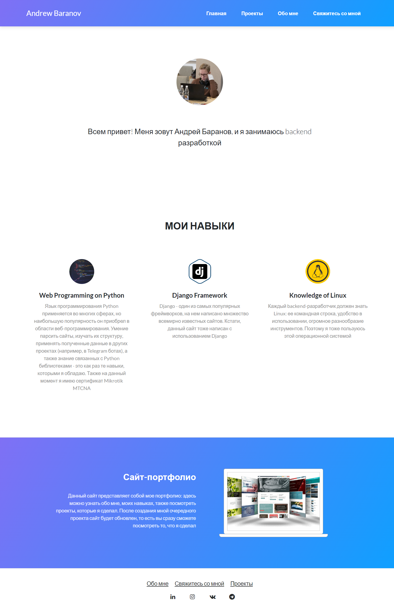
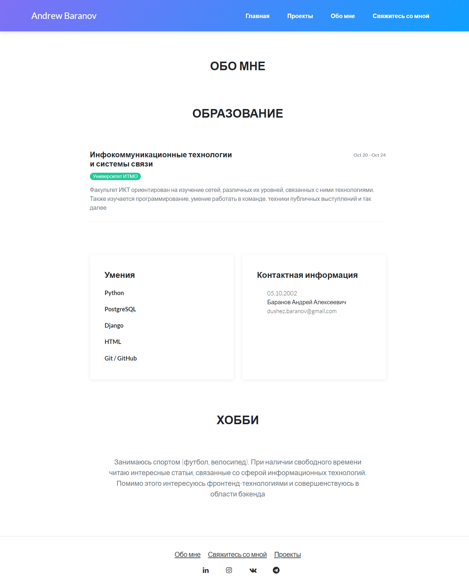
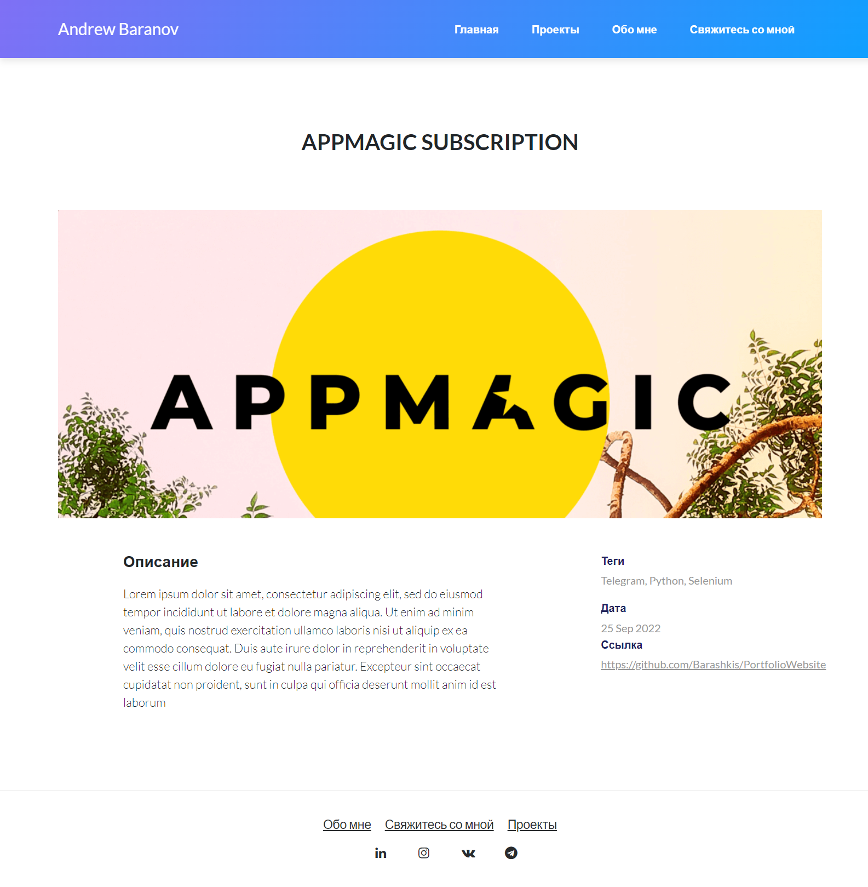
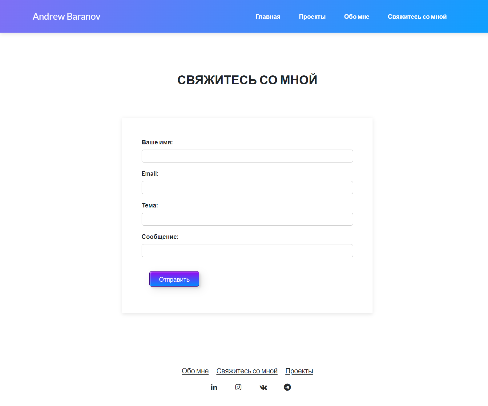

# Project description
Repository contains files of PortfolioWebsite

This is my portfolio site where you can find out about my skills, projects, contacts and so on.
It has its own admin panel to manage projects, tags and other models that has different fields of 
different types. Also, it has an ability to send emails to me after submitting the form by user

This project uses Python libraries (version 3.8) such as:
+ Django 3
+ Bootstrap
+ PostgreSQL
+ etc

# Demonstration

